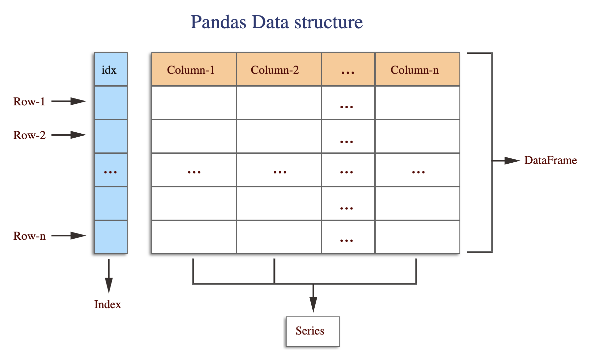

# Ultimate Python Snippets
## Pandas
### `data.index`


<br>

-----


#### What is `.index` for?

Immutable ndarray implementing an ordered, sliceable set. The basic object storing axis labels for all pandas objects. With this method we can determine which data column to use as an index.

Index is not part of the DataFrame but it is useful for identification and readable.

**Syntax**

```python
data.index  
data.index.name
```


Every DataFrame has an index. By default, the “index” is the range of integers starting at 0, which looks something like this:




By default, if we don’t specify another index in some way, every DataFrame has an index like this.


<br>

--------

<br>


#### Getting `index` Information

We can use `.index` for getting default index column information. The result syntax looks like this :

`RangeIndex(start=0, stop=193, step=1)`

It means the index column starts at 0, ends at 193 and increases one by one.


```python
import pandas as pd

drinks = pd.read_csv("files/drinks.csv")
print(drinks.head()) # Shows first few rows of the data

print(drinks.index)
```

**Output**

```
       country  beer_servings  spirit_servings  wine_servings  total_litres_of_pure_alcohol continent
0  Afghanistan              0                0              0                           0.0      Asia
1      Albania             89              132             54                           4.9    Europe
2      Algeria             25                0             14                           0.7    Africa
3      Andorra            245              138            312                          12.4    Europe
4       Angola            217               57             45                           5.9    Africa

RangeIndex(start=0, stop=193, step=1)
```

<br>

--------


<br>


#### Setting a column as `index`


```python
import pandas as pd

drinks = pd.read_csv("files/drinks.csv")
print(drinks.head())

drinks.index = drinks['country']
print(drinks.head())

drinks.index = drinks['continent']
print(drinks.head())
```

**Output**

```
       country  beer_servings  spirit_servings  wine_servings  total_litres_of_pure_alcohol continent
0  Afghanistan              0                0              0                           0.0      Asia
1      Albania             89              132             54                           4.9    Europe
2      Algeria             25                0             14                           0.7    Africa
3      Andorra            245              138            312                          12.4    Europe
4       Angola            217               57             45                           5.9    Africa


                 country  beer_servings  spirit_servings  wine_servings  total_litres_of_pure_alcohol continent
country                                                                                                        
Afghanistan  Afghanistan              0                0              0                           0.0      Asia
Albania          Albania             89              132             54                           4.9    Europe
Algeria          Algeria             25                0             14                           0.7    Africa
Andorra          Andorra            245              138            312                          12.4    Europe
Angola            Angola            217               57             45                           5.9    Africa


                country  beer_servings  spirit_servings  wine_servings  total_litres_of_pure_alcohol continent
continent                                                                                                    
Asia       Afghanistan              0                0              0                           0.0      Asia
Europe         Albania             89              132             54                           4.9    Europe
Africa         Algeria             25                0             14                           0.7    Africa
Europe         Andorra            245              138            312                          12.4    Europe
Africa          Angola            217               57             45                           5.9    Africa
```

<br>

--------


<br>


#### Clearing `index` column name


```python
import pandas as pd

drinks = pd.read_csv("files/drinks.csv")
print(drinks.head())

drinks.index = drinks['country']
print(drinks.head())

drinks.index.name = None
print(drinks.head())
```

**Output**

```
                country  beer_servings  spirit_servings  wine_servings  total_litres_of_pure_alcohol continent
country                                                                                                        
Afghanistan  Afghanistan              0                0              0                           0.0      Asia
Albania          Albania             89              132             54                           4.9    Europe
Algeria          Algeria             25                0             14                           0.7    Africa
Andorra          Andorra            245              138            312                          12.4    Europe
Angola            Angola            217               57             45                           5.9    Africa


                 country  beer_servings  spirit_servings  wine_servings  total_litres_of_pure_alcohol continent
Afghanistan  Afghanistan              0                0              0                           0.0      Asia
Albania          Albania             89              132             54                           4.9    Europe
Algeria          Algeria             25                0             14                           0.7    Africa
Andorra          Andorra            245              138            312                          12.4    Europe
Angola            Angola            217               57             45                           5.9    Africa
```

<br>

--------


<br>


#### Setting a range as `index`


```python
import pandas as pd

drinks = pd.read_csv("files/drinks.csv")
print(drinks.head())

drinks.index = range(1, len(drinks) * 2, 2)
print(drinks.head())
```

**Output**

```
       country  beer_servings  spirit_servings  wine_servings  total_litres_of_pure_alcohol continent
0  Afghanistan              0                0              0                           0.0      Asia
1      Albania             89              132             54                           4.9    Europe
2      Algeria             25                0             14                           0.7    Africa
3      Andorra            245              138            312                          12.4    Europe
4       Angola            217               57             45                           5.9    Africa


country  beer_servings  spirit_servings  wine_servings  total_litres_of_pure_alcohol continent
1  Afghanistan              0                0              0                           0.0      Asia
3      Albania             89              132             54                           4.9    Europe
5      Algeria             25                0             14                           0.7    Africa
7      Andorra            245              138            312                          12.4    Europe
9       Angola            217               57             45                           5.9    Africa
```

<br>

--------


<br>


#### Setting custom `index` names


```python
import pandas as pd

drinks = pd.read_csv("files/drinks.csv")
print(drinks.head())

drinks.index = ["row_" + str(i+1) for i in range(len(drinks))]
print(drinks.head())

drinks.index.name = "ROWS"
print(drinks.head())
```

**Output**

```
       country  beer_servings  spirit_servings  wine_servings  total_litres_of_pure_alcohol continent
0  Afghanistan              0                0              0                           0.0      Asia
1      Albania             89              132             54                           4.9    Europe
2      Algeria             25                0             14                           0.7    Africa
3      Andorra            245              138            312                          12.4    Europe
4       Angola            217               57             45                           5.9    Africa


           country  beer_servings  spirit_servings  wine_servings  total_litres_of_pure_alcohol continent
row_1  Afghanistan              0                0              0                           0.0      Asia
row_2      Albania             89              132             54                           4.9    Europe
row_3      Algeria             25                0             14                           0.7    Africa
row_4      Andorra            245              138            312                          12.4    Europe
row_5       Angola            217               57             45                           5.9    Africa


           country  beer_servings  spirit_servings  wine_servings  total_litres_of_pure_alcohol continent
ROWS                                                                                                     
row_1  Afghanistan              0                0              0                           0.0      Asia
row_2      Albania             89              132             54                           4.9    Europe
row_3      Algeria             25                0             14                           0.7    Africa
row_4      Andorra            245              138            312                          12.4    Europe
row_5       Angola            217               57             45                           5.9    Africa
```

<br>

--------
